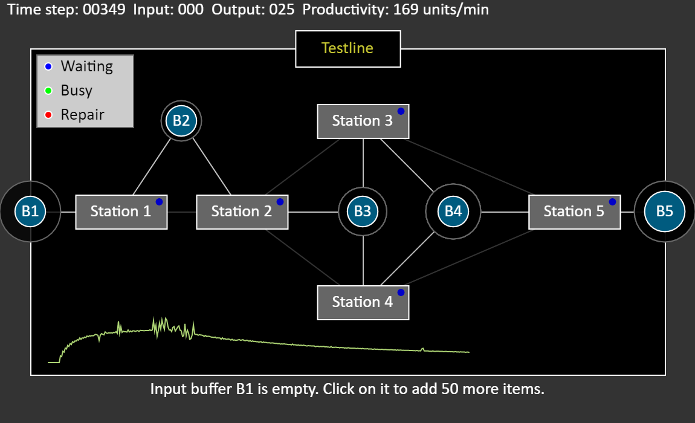

# production-line-simulation
A production line simulation in the browser.

Simulation of a production line with multiple, possibly paralell, stations and various buffer capacities. Imlementation of a non-deterministic multi-stage producer-consumer pattern.

## Description
Discrete-time simulation of a factory-like production line. It supports multiple stations which can be linked serially, in paralell or in any combination thereof.

### Other features
- The production line is implemented as a multi-level bi-directional linked list where each station is aware of the station that follows but also on the previous stations
- The input to a station is drawn either directly from a previous station or from a FIFO-buffer
-Configurable station throughput times, buffer sizes, failure probabilities
- Supports shared buffers between stations
- Simulated station failures which affect the overall production rate
- The visual output of the full production line is based on forward recursion
- Time-based update of the production line based on a recursive backward propagation 
 algorithm
- Generates a realtime performance metric in terms of the overall productivity

# Possible improvements
- Avoid drawing stations and buffer more than once
- Andicate flows (connections) by arrows instead of center-based lines
- Separate the model from the visual elements

[repair-symbol]: https://s-media-cache-ak0.pinimg.com/originals/b7/f5/7e/b7f57ed2cb73041d0e87b32456c82a5c.png
[repair-symbol-search]: https://www.google.se/search?hl=sv&site=imghp&tbm=isch&source=hp&biw=1536&bih=759&q=repair+symbol&oq=repair+symbol&gs_l=img.3..0i19k1l2j0i5i30i19k1.840.3008.0.3686.14.14.0.0.0.0.95.845.13.13.0....0...1.1.64.img..1.13.840.0..0j0i30k1j0i8i30i19k1.P1hojc9YQDU#imgrc=6aIINE-4O9SU-M:
[alarm-sound]: http://soundbible.com/287-Industrial-Alarm.html

[parcel]: https://parceljs.org/
